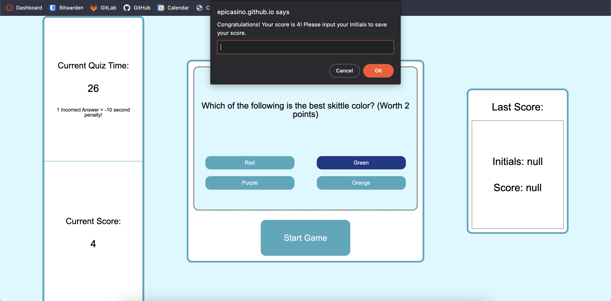

# JavaScript Quiz (Challenge 4)

## Description

Provide a short description explaining the what, why, and how of your project. Use the following questions as a guide:

- I built a simple JavaScript quiz that incorporates localstorage in order to save your score.
- This project provided a further understanding in JavaScript logic and WebAPIs.
- Traversing the DOM has also given me a further understanding with HTML structure.

## Installation

No extensive installation is needed. Simply access via [Gitpages](https://epicasino.github.io/JS-Quiz/).

## Usage

**When accessing the live deployment, you will be presented with this page:**

**Upon clicking "Start Game", you will be presented with a series of questions. You can click on the correct answer (or incorrect answer) and be penalized or rewarded via +1 point.**
**At the end of the quiz, you will be presented with this prompt**

**After inputting an initial (or name), you will see this**

**After refreshing, your score will be saved on the right.**

## License

MIT License

Copyright (c) 2023 Ray Badua

Permission is hereby granted, free of charge, to any person obtaining a copy
of this software and associated documentation files (the "Software"), to deal
in the Software without restriction, including without limitation the rights
to use, copy, modify, merge, publish, distribute, sublicense, and/or sell
copies of the Software, and to permit persons to whom the Software is
furnished to do so, subject to the following conditions:

The above copyright notice and this permission notice shall be included in all
copies or substantial portions of the Software.

THE SOFTWARE IS PROVIDED "AS IS", WITHOUT WARRANTY OF ANY KIND, EXPRESS OR
IMPLIED, INCLUDING BUT NOT LIMITED TO THE WARRANTIES OF MERCHANTABILITY,
FITNESS FOR A PARTICULAR PURPOSE AND NONINFRINGEMENT. IN NO EVENT SHALL THE
AUTHORS OR COPYRIGHT HOLDERS BE LIABLE FOR ANY CLAIM, DAMAGES OR OTHER
LIABILITY, WHETHER IN AN ACTION OF CONTRACT, TORT OR OTHERWISE, ARISING FROM,
OUT OF OR IN CONNECTION WITH THE SOFTWARE OR THE USE OR OTHER DEALINGS IN THE
SOFTWARE.
